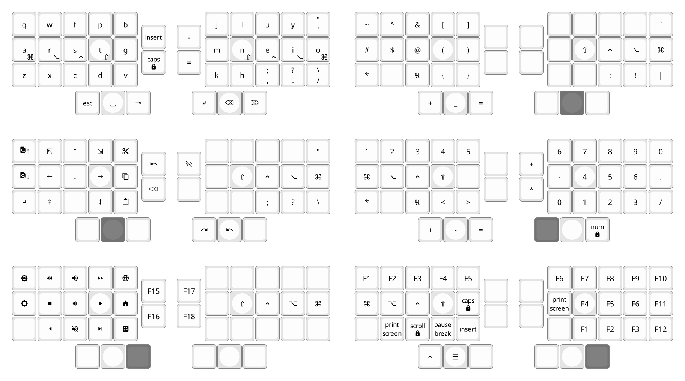

# sno36

An experimental 36 keys keyboard layout.



Main features/goals:

- optimized for 3×5+3 split keyboards
- one-hand navigation (with inverted T arrows) and system/media keys
- one-hand numerals and F-keys
- non-standard shifted punctuation and custom symbol layer grouping related characters on the same keys as follows:
  | base             | shift               | symbol                 |
  |------------------|---------------------|------------------------|
  | `,` (comma)      | `;` (semicolon)     | `:` (colon)            |
  | `.` (dot/period) | `?` (question mark) | `!` (exclamation mark) |
  | `/` (slash)      | `\` (backslash)     | `\|` (pipe)            |
  | `'` (quote)      | `"` (double quote)  | ``` ` ``` (back quote) |
  | `⎵` (space)      | `-` (dash/minus)    | `_` (underscore)       |

Obviously inspired by [Miryoku](https://github.com/manna-harbour/miryoku) but less principled and without the advanced QMK implementation details.


## Layout definition


### Colemak-DHm `base` layer

Except for quote key in place of semi-colon key (as semicolon and colon are remapped on comma key)

	|   q   |   w   |   f   |   p   |   b   ||   j   |   l   |   u   |   y   |   '   |
	|   a   |   r   |   s   |   t   |   g   ||   m   |   n   |   e   |   i   |   o   |
	|   z   |   x   |   c   |   d   |   v   ||   k   |   h   |   ,   |   .   |   /   |
	                |  ESC  | SPACE |  TAB  || BSPC  | ENTER |  DEL  |                


#### Custom `shifts`

	|       |       |       |       |       ||       |       |       |       |   "   |
	|       |       |       |       |       ||       |       |       |       |       |
	|       |       |       |       |       ||       |       |   ;   |   ?   |   \   |
	                |       |   -   |       ||       |       |       |                

- `,`, `.`, `/` shift to `;`, `?`, `\` respectively
- `space` shits to `-`.

#### Home row mods and layers with `tap-hold`

	|       |       |       |       |       ||       |       |       |       |       |
	| SUPER |  ALT  | CTRL  | SHIFT |       ||       | SHIFT | CTRL  |  ALT  | SUPER |
	|       |       |       |       |       ||       |       |       |       |       |
	                |  MWH  |  NAV  |  SYS  ||  NUM  |  SYM  |  FUN  |                


### Symbols (`SYM`)

	|   ~   |   $   |   @   |   [   |   ]   ||       |       |       |       |   `   |
	|   #   |   ^   |   &   |   (   |   )   ||       | SHIFT | CTRL  |  ALT  | SUPER |
	|   *   |       |   %   |   {   |   }   ||       |       |   :   |   !   | PIPE  |
	                |   +   |   _   |   =   ||       |  XXX  |       |                

- `:`, `!`, `|`, `` ` `` over base `,`, `.`, `/`, `'`
- `_` over base `space`
- `*`, `+` in the same spot as on numerals layer
- Separate brackets/braces pairs.


### Numerals (`NUM`)

	|   1   |   2   |   3   |   4   |   5   ||   6   |   7   |   8   |   9   |   0   |
	| SUPER |  ALT  | CTRL  | SHIFT |       ||   -   |   4   |   5   |   6   |   .   |
	|   *   |       |       |   <   |   >   ||   0   |   1   |   2   |   3   |   /   |
					|   +   |   -   |   =   ||  XXX  |       |       |                

- One-hand numpad with extra `.` and `-`
- `/` in the same spot as on base layer, `*` in mirror position on other hand
- `-` over `space`, `+` next to `-`,
- `=` in the same spot as on symbols layer
- `<` and `>` aligned with braces on symbol layer
- also num-row because why not


### Function keys (`FUN`)

	|  F1   |  F2   |  F3   |  F4   |  F5   ||  F6   |  F7   |  F8   |  F9   |  F10  |
	| SUPER |  ALT  | CTRL  | SHIFT |       || PSCR  |  F4   |  F5   |  F6   |  F11  |
	|       |       |  INS  | SLCK  | PAUSE ||       |  F1   |  F2   |  F3   |  F12  |
	                |       |  APP  |       ||       |       |  XXX  |                

- `F1`-`F9` in the same positions as respective digits in numerals layer
- `F10`-`F12` on outer column downwards
- `print scr` on same side for one-hand screenshots


### Navigation (`NAV`)

	| FIND- | HOME  |  UP   |  END  | CUT   ||       |       |       |       |       |
	| FIND+ | LEFT  | DOWN  | RIGHT | COPY  ||       | SHIFT | CTRL  |  ALT  | SUPER |
	|       | PG_U  |       | PG_D  | PASTE ||       |       |       |       |       |
	                |       |  XXX  |       || UNDO  |       | REDO  |                

- inverted T arrows, home/end, page up/down
- copy/cut/paste on inner column
- find next/previous on outer column
- undo/redo with other hand


### System/media keys (`SYS`)

	| BRI+  |  RWD  | VOL+  |  FFW  |MYCOMP ||       |       |       |       |       |
	| BRI-  | STOP  | VOL-  | PLAY  |  WWW  ||       | SHIFT | CTRL  |  ALT  | SUPER |
	|       | PREV  | MUTE  | NEXT  | CALC  ||       |       |       |       |       |
	                |       |       |  XXX  ||       |       |       |                

- volume up/down and stop/play over arrows
- mute below volume down
- rewind/forward over home/end, previous/next track over page up/down
- home folder, browser, calculator shortcuts on inner column


### Mouse scrolling (`MWH`)

Not convinced about full mouse emulation but one-hand scrolling could be useful.

	|       |       | WH_U  |       |       ||       |       |       |       |       |
	|       | WH_L  | WH_D  | WH_R  |       ||       | SHIFT | CTRL  |  ALT  | SUPER |
	|       |       |       |       |       ||       |       |       |       |       |
	                |  XXX  |       |       ||       |       |       |                


### Unicode Symbols on `NUM>NAV`

For science?

	|       |   €   |   °   |       |       ||       |   Δ   |   ε   |   μ   |       |
	|   ∞   |   ×   |   √   |   ²   |   ³   ||       |   α   |   β   |   λ   |       |
	|   ±   |   ≠   |   ≈   |   ≤   |   ≥   ||       |   φ   |   θ   |   π   |       |
	                |       |  XXX  |       ||       |       |       |                


### Firmware on `NUM+FUN` combo

Keep firmware stuff out of the way behind a combo that needs two fingers.  
`OSX`, `LINUX`, `WIN` keys should select the mode for OS-specific inputs (such as undo/redo actions or Unicode) according to implementation.

	| RESET |       |       |       |  OSX  ||       |       |       |       |       |
	| DEBUG |       |       |       | LINUX ||       |       |       |       |       |
	|       |       |       |       |  WIN  ||       |       |       |       |       |
	                |       |       |       ||  XXX  |       |  XXX  |                


## Implemtentation

The layout is currently implemented as a basic [QMK](https://qmk.fm/) `split_3x5_3` layout
(with its [`keymaps`](qmk-layout/generated.h) tables auto-generated from the data in the above section)
and can be flashed to any QMK keyboard supporting `split_3x5_3` layouts.
