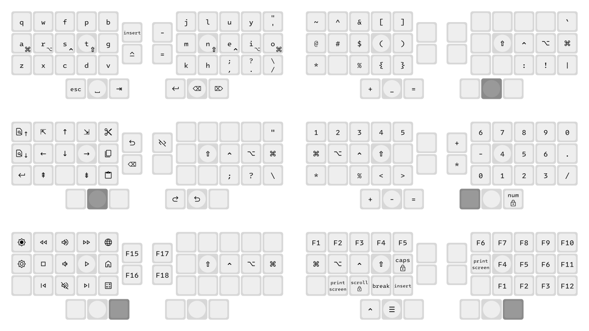

# Ichnite Layout

An experimental 40/36 keys keyboard layout.



Main features/goals:

- optimized for 3×5+3 split keyboards with extra (optional) 2-key inner columns
- one-hand navigation (with inverted T arrows) and system/media keys
- one-hand numerals and F-keys (same arrangement)
- non-standard shifted punctuation and custom symbol layer grouping related characters on the same keys as follows:
  | base             | shift               | symbol                 |
  |------------------|---------------------|------------------------|
  | `,` (comma)      | `;` (semicolon)     | `:` (colon)            |
  | `.` (dot/period) | `?` (question mark) | `!` (exclamation mark) |
  | `/` (slash)      | `\` (backslash)     | `\|` (pipe)            |
  | `'` (quote)      | `"` (double quote)  | `` ` `` (back quote)   |

Obviously inspired by [Miryoku](https://github.com/manna-harbour/miryoku) but less principled and without the advanced QMK implementation details.


## Layout definition


### Colemak-DHm `base` layer

Except for quote key in place of semi-colon key (as semicolon and colon are remapped on comma key)
```
|   q   |   w   |   f   |   p   |   b   |                   |   j   |   l   |   u   |   y   |  '"   |
|   a   |   r   |   s   |   t   |   g   |  INS  |   |   -   |   m   |   n   |   e   |   i   |   o   |
|   z   |   x   |   c   |   d   |   v   | CAPS  |   |   =   |   k   |   h   |  ,;   |  .?   |  /\   |
|               |  ESC  | SPACE |  TAB  |                   | ENTER | BSPC  |  DEL  |               |
```
`,`, `.`, `/` shift to `;`, `?`, `\` respectively


### Home row mods and layers with `hold-tap`
```
|       |       |       |       |       |                    |       |       |       |       |       |
|  CMD  |  ALT  | CTRL  | SHIFT |       |       |    |       |       | SHIFT | CTRL  |  ALT  |  CMD  |
|       |       |       |       |       |       |    |       |       |       |       |       |       |
|               |  MOU  |  NAV  |  SYS  |                    |  NUM  |  SYM  |  FUN  |               |
```


### Symbols (`SYM`)
```
|   ~   |   ^   |   &   |   [   |   ]   |                    |       |       |       |       |   `   |
|   @   |   #   |   $   |   (   |   )   |       |    |       |       | SHIFT | CTRL  |  ALT  |  CMD  |
|   *   |       |   %   |   {   |   }   |       |    |       |       |       |   :   |   !   | PIPE  |
|               |   +   |   _   |   =   |                    |       |  XXX  |       |               |
```
- `:`, `!`, `|`, `` ` `` over base `,`, `.`, `/`, `'`
- `_` over base `space`
- `*`, `+`, `%` in the same spot as on numerals layer
- Separate brackets/braces pairs.


### Numerals (`NUM`)
```
|   1   |   2   |   3   |   4   |   5   |                    |   6   |   7   |   8   |   9   |   0   |
|  CMD  |  ALT  | CTRL  | SHIFT |       |       |    |   +   |   -   |   4   |   5   |   6   |   .   |
|   *   |       |   %   |   <   |   >   |       |    |   *   |   0   |   1   |   2   |   3   |   /   |
|               |   +   |   -   |   =   |                    |  XXX  |       | NLOCK |               |
```
- One-hand numpad arrangement with extra `.` and `-`
- `/` in the same spot as on base layer, `*` in mirror position on other hand
- `-` over `space`, `+` next to `-`,
- `=`, `%` in the same spot as on symbols layer
- `<` and `>` aligned with braces on symbol layer
- also num-row because why not


#### Keypad numerals (`KP`) on `NUM+SYM` combo

Same as above but with keypad numbers.
```
|  KP1  |  KP2  |  KP3  |  KP4  |  KP5  |                    |  KP6  |  KP7  |  KP8  |  KP9  |  KP0  |
|  CMD  |  ALT  | CTRL  | SHIFT |       |       |    |  KP+  |  KP-  |  KP4  |  KP5  |  KP6  |  KP.  |
|  KP*  |       |   %   |   <   |   >   |       |    |  KP*  |  KP0  |  KP1  |  KP2  |  KP3  |  KP/  |
|               |  KP+  |  KP-  |  KP=  |                    |  XXX  |  XXX  |       |               |
```


### Function keys (`FUN`)
```
|  F1   |  F2   |  F3   |  F4   |  F5   |                    |  F6   |  F7   |  F8   |  F9   |  F10  |
|  CMD  |  ALT  | CTRL  | SHIFT | CLOCK |       |    |       | PSCR  |  F4   |  F5   |  F6   |  F11  |
|       | PSCR  | SLOCK | BREAK |  INS  |       |    |       |       |  F1   |  F2   |  F3   |  F12  |
|               | rCTRL |  APP  |       |                    |       |       |  XXX  |               |
```
- `F1`-`F9` in the same positions as respective digits in numerals layer
- `F10`-`F12` on outer column downwards
- `print screen` on same side for one-hand screenshots
- `right control` key to escape Virtualbox


### Navigation (`NAV`)
```
| FIND- | HOME  |  UP   |  END  |  CUT  |                    |       |       |       |       |   "   |
| FIND+ | LEFT  | DOWN  | RIGHT | COPY  | UNDO  |    |COMMENT|       | SHIFT | CTRL  |  ALT  |  CMD  |
| ENTER | PG_UP |       | PG_DN | PASTE | BSPC  |    |       |       |       |   ;   |   ?   |   \   |
|               |       |  XXX  |       |                    | REDO  | UNDO  |       |               |
```
- inverted T arrows, home/end, page up/down
- copy/cut/paste on inner column
- find next/previous on outer column
- `undo`/`redo` over `backspace`/`enter`
- redundant `enter` on outer column for one-hand access
- redundant `;`, `?`, `\`, `"` in case implementation does not support custom shifting


### System/media keys (`SYS`)
```
| BRI+  |  RWD  | VOL+  |  FFW  |  WWW   |                    |       |       |       |       |       |
| BRI-  | STOP  | VOL-  | PLAY  | MYCOMP |  F15  |    |  F17  |       | SHIFT | CTRL  |  ALT  |  CMD  |
|       | PREV  | MUTE  | NEXT  | CALC   |  F16  |    |  F18  |       |       |       |       |       |
|               |       |       |  XXX   |                    |       |       |       |               |
```
- volume up/down and stop/play over arrows
- mute below volume down
- rewind/forward over home/end, previous/next track over page up/down
- home folder, browser, calculator shortcuts on inner column


### Mouse Emulation (`MOU`)
```
| MB_2  |       | MM_U  |       |       |                    |       |       |       |       |       |
| MB_1  | MM_L  | MM_D  | MM_R  |       |       |    |       |       | SHIFT | CTRL  |  ALT  |  CMD  |
| MB_3  |       |       |       |       |       |    |       |       |       |       |       |       |
|               |  XXX  |       |       |                    |       |       |       |               |
```
- mouse mouvement over arrows
- mouse click on outer column


### Unicode Symbols (`UTF`) on `NAV>SYM`

For science?
```
|   ≈   |       |       |   √   |   ∛   |                    |       |   μ   |   Δ   |   ε   |       |
|   ∞   |   €   |       |   ²   |   ³   |       |    |       |       |   π   |   φ   |   θ   |       |
|   ×   |       |   °   |   ≤   |   ≥   |       |    |       |   λ   |   α   |   β   |   ¿   |   ÷   |
|               |   ±   |  XXX  |   ≠   |                    |       |       |  XXX  |               |
```


### Firmware (`FW`) on `NUM+FUN` or `MOU+SYS` combo

Keep firmware stuff out of the way behind a combo that needs two fingers.
```
|  BT1  |  BT2  |  BT3  |  BT4  |  BT5  |                    |       |       |       |       |  USB  |
|       | @win  | @mac  |@linux |       |       |    |       |       |  BT4  |  BT5  |       |       |
|       |       |       |       |       |       |    |       |  USB  |  BT1  |  BT2  |  BT3  |       |
|               |       | BOOTL |       |                    |       | BOOTL |       |               |
```
- `@linux`, `@mac`, `@win` keys to select the mode for OS-specific inputs (such as undo/redo actions or Unicode)
- Bluetooth output selection over corresponding `1`-`5` numerals, USB output over `0`


## OS specific macros

|         | linux    | mac         | win      |
|---------|----------|-------------|----------|
|  COPY   | CTRL+C   | CMD+C       | CTRL+C   |
|  CUT    | CTRL+X   | CMD+X       | CTRL+X   |
|  PASTE  | CTRL+V   | CMD+V       | CTRL+V   |
|  UNDO   | CTRL+Z   | CMD+Z       | CTRL+Z   |
|  REDO   | CTRL+Y   | CMD+Y       | CTRL+Y   |
|  FIND+  | F3       | CMD+G       | F3       |
|  FIND-  | SHIFT+F3 | SHIFT+CMD+G | SHIFT+F3 |
| COMMENT | CTRL+/   | CMD+/       | CTRL+/   |
|  CMD    | CMD      | CTRL        | CMD      |
|  CTRL   | CTRL     | CMD         | CTRL     |


## Implementation

The layout is currently implemented as both ZMK[^zmk] [keymap](impl/zmk-keymap/ichnite.keymap) and a QMK[^qmk] [layout](impl/qmk-layout) generated from the above sections.


[^zmk]: https://zmk.dev
[^qmk]: https://qmk.fm/
